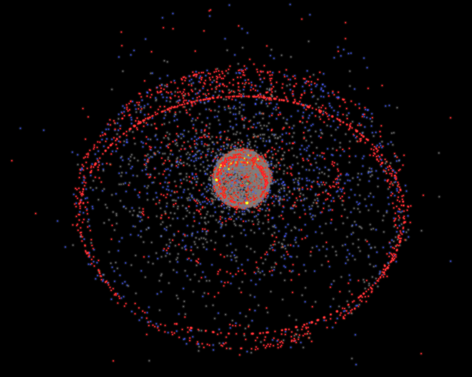
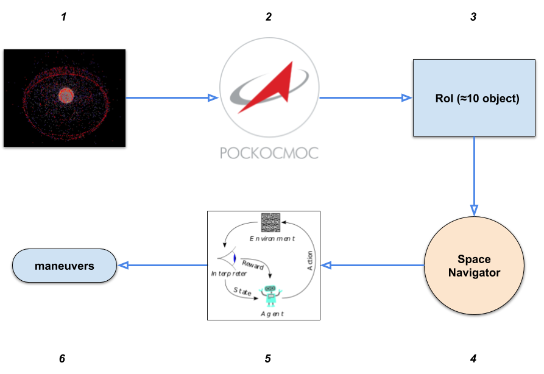

# Satellite Collision Avoidance


## Motivation

Since 2004 the amount of space launches has been gradually increased. Currently, there are more than 100 satellites launched into space every year. This number could be expanded rapidly due to such projects as providing global internet by Starlink. The increasing amount of objects in space leads to a higher probability of their collision.

Most cases of collision is currently processed manually. In this project, we investigate methods of **reinforcement learning** to create a system for **automatic maneuver optimization** in order to prevent collisions.

||
|:--:| 
|Space debris reconstrucion from [Stuffin Space project](http://stuffin.space)|

## What is this project about?

Here is the activity model in a **use case**:



**1** and **2**: Space objects are monitored by ROSCOSCMOS <br />
**3**: ROSCOSCMOS provides most dangerous objects <br /> 
**4**: Space Navigator gets data from ROSCOSCMOS <br />
**5**: Environment is solved with RL <br />
**6**: Space Navigator returns optimal collision avoidance maneuver <br />

## Installation

### Step 1

To set up the project first copy the repo to your local machine:

``` 
git clone https://github.com/yandexdataschool/satellite-collision-avoidance.git
```

### Step 2

After cloning the repo, install **requirements**:

```
 pip install -r requirements.txt
```

We use following libraries:
> * Pykep
> * Pandas
> * Matplotlib
> * Numpy
> * Scipy

### Step 3

Install the package:
```
python setup.py install
```

or use for development:
```
python setup.py develop
```

### Run Examples

Now you can run examples of space simulator.

Run following code:
```
python examples/test_flight.py 
```

If evereything is correct, you should get such plot:


And output:
```
Start time: 6000.0   End time: 6000.01   Simulation step:0.0001

...
Space objects description
...

Simulation ended.
Collision probability: 0.0.
Reward: -4.539992976249074e-05.
Fuel consumption: 0.0.
```

## Running the test

Currently there are only tests for api module. Run it with command:
```
python tests/test_api.py
```

## Documentation and tutorials

Tutorial on environment setup and simulator:
* [Simulator](examples/Notebooks/Simulator_tutorial    .ipynb)

Tutorial on learning an agent: 
* [MCTC](examples/Notebooks/MCTS_tutorial.ipynb)
* [CE](examples/Notebooks/CE_tutorial.ipynb)

## RL Methods description

1. [MCTS](space_navigator/models/MCTS/MCTS.md)
2. [CE](space_navigator/models/CE/CE.md)

<!-- ## Authors

* **Nikita Kazeev** - scientific director, Yandex LAMBDA Factory
* **Irina Ponomareva** - scientific advisor, TSNIIMASH
* **Leonid Gremyachi** - MSc in computer science, NRU-HSE, 1st year.
* **Dubov Dmitry** - BSc in computer science, NRU-HSE, 4th year. -->

<!-- See also the list of [contributors](https://github.com/your/project/contributors) who participated in this project.
 -->

<!-- ## License

This project is licensed under the TSNIIMASH and LAMBDA Factory. (?)
 -->

<!-- ## Acknowledgments

* Hat tip to anyone who's code was used
* Inspiration
* etc -->

## Useful links

* For space simulation and calculations we use **pykep** library. [[Pykep](https://esa.github.io/pykep/)]
* http://stuffin.space/